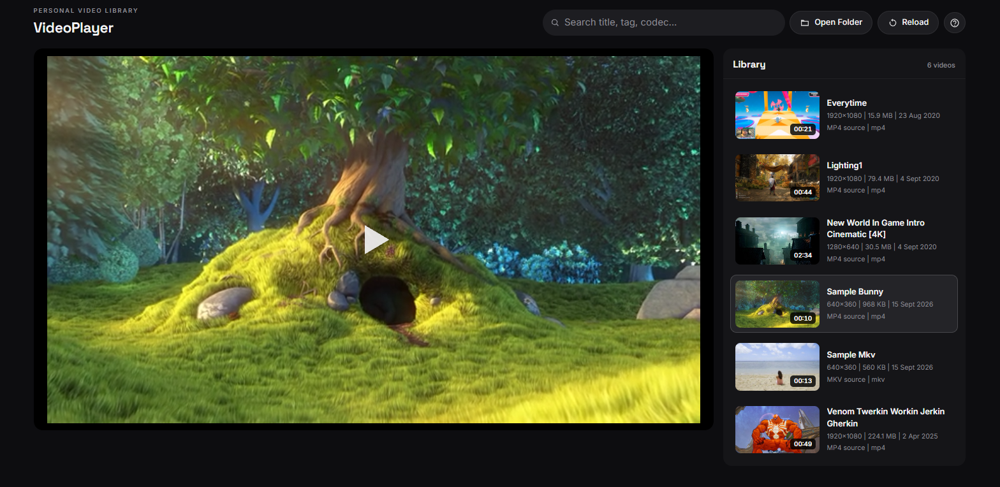

# VideoPlayer

A self-hosted personal video library with a modern, responsive dark UI — built
with plain HTML/CSS/JS. **No build step, no npm install, no framework.** Drop it
on any web host (PHP optional) and it plays your files.



## Highlights

- **Hybrid playback engine (native-first):** MP4/WebM play through the browser's
  native `<video>` element — hardware acceleration, Picture-in-Picture, instant
  seeking. For formats browsers can't play (MKV, MOV...), the app transparently
  switches to a [MediaBunny](https://mediabunny.dev)-powered canvas player.
  Prefer an engine manually in *Settings → Playback engine*.
- **Auto-discovering library:** `videos.php` scans `videos/` server-side, groups
  multi-format variants per video, and matches poster art. Without PHP it falls
  back to a JSON manifest, directory listing, or local folder import.
- **Automatic thumbnails:** missing poster images are generated by decoding a
  frame from the video, cached in IndexedDB for fast reloads, and only produced
  for cards that scroll into view.
- **Automatic metadata hydration:** duration, resolution, and codec are probed
  per file and filled into the cards.
- **Modern UI:** dark glass design, theater mode, zoom + pan, mini player,
  search, per-video resume positions, keyboard shortcuts, fully responsive from
  phones to widescreen.

## Quick start

```bash
# from the repo root
node tools/serve.mjs 8080
# open http://localhost:8080
```

Then put video files in `videos/`. That's the whole setup — the dev server above
is a tiny zero-dependency Node script; any static file server with HTTP range
support works too.

### On shared hosting (PHP)

1. Copy the repo contents to your webspace.
2. Drop your files into `videos/`.
3. Open `index.html` — the badge should read `Source: PHP auto-scan`.

If PHP isn't available, the app falls back to:

1. `videos/videos.json` or `videos.json` manifest
2. Directory index parsing (`videos/`) if the host exposes listings
3. The **Open Folder** button (client-side folder import)

### Run it offline / from disk

You can double-click `index.html` and open it directly from disk (`file://`). ES
module restrictions don't apply here because the player is a plain classic
script, so the UI works right away — use **Open Folder** to pick the folder with
your videos (scanning `videos.php` and manifests requires HTTP).

### Poster art

`videos/posters/<video-basename>.jpg|jpeg|png|webp` — otherwise thumbnails are
extracted automatically.

```text
VideoPlayer/
  index.html
  styles.css
  app.js
  vendor/mediabunny.min.cjs
  videos.php
  tools/serve.mjs
  tools/generate-manifest.mjs
  videos/
    your-video.mp4
    your-video.webm
    posters/
      your-video.jpg
```

## Format guidance

- **Best compatibility:** MP4 (H.264 + AAC)
- **Fallback formats:** WebM
- MKV and MOV play via the MediaBunny engine where codecs are available

## Keyboard shortcuts

| Key | Action |
| --- | --- |
| `Space` | Play / pause |
| `←` / `→` | Seek ±5 s |
| `N` / `P` | Next / previous video |
| `F` | Fullscreen |
| `T` | Theater mode |
| `M` | Mute |
| `/` | Focus search |
| `?` | Shortcut help |

## Why MediaBunny?

Native playback is always preferred — it's what MediaBunny's own docs recommend
for plain watching, and it's the most efficient path on every device. MediaBunny
is used where native support ends: demuxing/decoding formats the browser can't
play, extracting thumbnail frames, and probing metadata. It's bundled as a
versioned file (`vendor/mediabunny.min.cjs`), so the player works fully offline
with no CDN dependency.

## Notes

- PiP depends on browser support and the native engine.
- `videos.php` requires a PHP 7+ host; static hosts use the fallbacks above.
- The optional `node tools/generate-manifest.mjs` command precomputes metadata
  with ffprobe but is not required for normal use.

## License

[MIT](LICENSE) · MediaBunny is vendored under [MPL-2.0](https://github.com/Vanilagy/mediabunny/blob/main/LICENSE).
